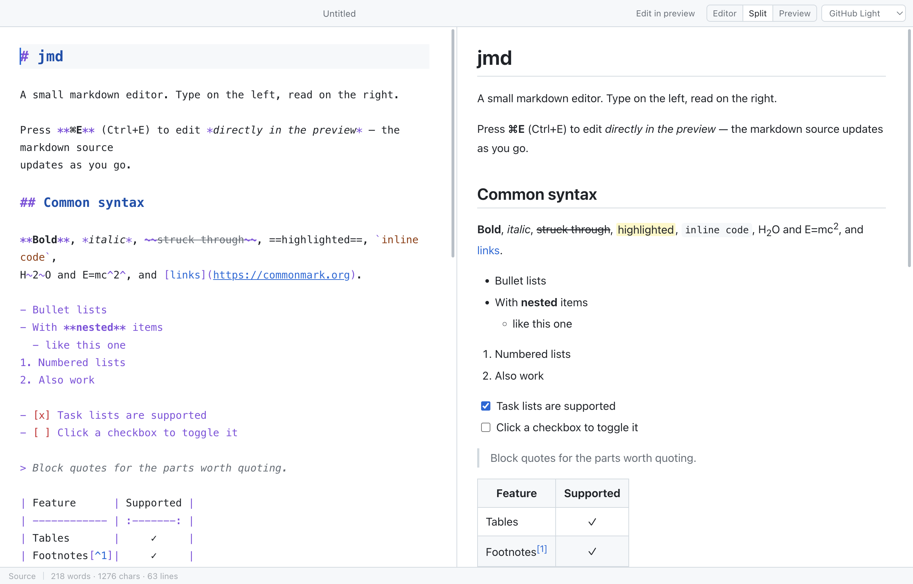

# jmd

A small markdown editor: source on the left, live preview on the right, and the
preview is editable too. Electron, so the same code runs on macOS and Windows.



## What it does

- **Live preview** beside the editor, re-rendered as you type. Only the blocks
  that actually changed are replaced in the DOM, so scroll position, image
  decode state and the caret survive a keystroke.
- **Edit in the preview** (⌘E / Ctrl+E). Type in the rendered document and the
  markdown source updates under you — see [below](#editing-in-the-preview) for
  how far that goes.
- **Math** — `$inline$` and `$$display$$`, rendered with KaTeX. `Costs $5 and
  $6` stays prose; a `$` only opens math when it hugs its content.
- **Images**, including relative paths, which resolve against the folder of the
  file you have open.
- **The usual syntax** plus tables, footnotes, definition lists, task lists,
  `==highlight==`, `~sub~`/`^sup^`, and syntax-highlighted code fences.
- **Six colour templates**, covering the editor, the preview and the chrome
  from a single set of CSS variables.
- **Scroll sync** in both directions, anchored on source lines rather than on a
  scroll percentage, so long code blocks and images don't drift.
- **Export to standalone HTML** carrying the current theme.

## Running it

```sh
npm install
npm start          # build, then launch
npm run dev        # vite dev server + electron, with hot reload
npm run smoke      # drive the real app end to end (needs `npm run dev` running)
```

Packaging:

```sh
npm run dist:mac   # dmg + zip in release/
npm run dist:win   # nsis installer
```

## Keys

| | |
| --- | --- |
| ⌘N / ⌘O / ⌘S | New, open, save |
| ⌘⇧S | Save as |
| ⌘F | Find in source |
| ⌘1 / ⌘2 / ⌘3 | Editor · split · preview |
| ⌘E | Toggle editing in the preview |
| ⌘Z / ⌘⇧Z | Undo / redo, from either pane |

Drag the divider to resize the panes; double-click it to reset to 50/50.
Double-click any preview block to jump the source caret to that line.

## Editing in the preview

The markdown source stays the single source of truth. When you type in the
preview, jmd waits for a pause, converts **only the blocks you touched** back to
markdown, and splices those lines into the source. Everything you didn't touch
keeps its exact original formatting — your choice of `*` vs `_`, your line
wrapping, your raw HTML. A whole-document round trip would normalise all of it,
which is why it doesn't do that.

Blocks whose markup cannot survive an HTML round trip are read-only in this
mode and marked as such: **math, code fences and raw HTML**. Clicking one jumps
the source caret to it so you can edit it on the left.

Everything else — paragraphs, headings, lists, tables, links, emphasis — is
editable in place, and pressing Enter creates real new blocks.

## Layout

```
electron/          main process: windows, menus, file dialogs, jmd-file:// scheme
src/
  main.js          wiring: state, layout, themes, scroll sync, file access
  editor/          CodeMirror 6 source pane
  markdown/        markdown-it pipeline + the KaTeX plugin
  preview/         rendering, DOM patching, and the in-preview editor
  styles/          app chrome, preview typography, colour templates
test/smoke.cjs     end-to-end checks against a real Electron window
```

The renderer is sandboxed with context isolation; rendered HTML goes through
DOMPurify before it reaches the DOM, and local files are served over a
dedicated `jmd-file://` scheme rather than by relaxing the CSP.

## Adding a theme

Add a block of CSS variables to `src/styles/themes.css` (copy an existing one —
every theme sets the same token vocabulary) and one entry to the list in
`src/themes.js`. Nothing else needs to change.
