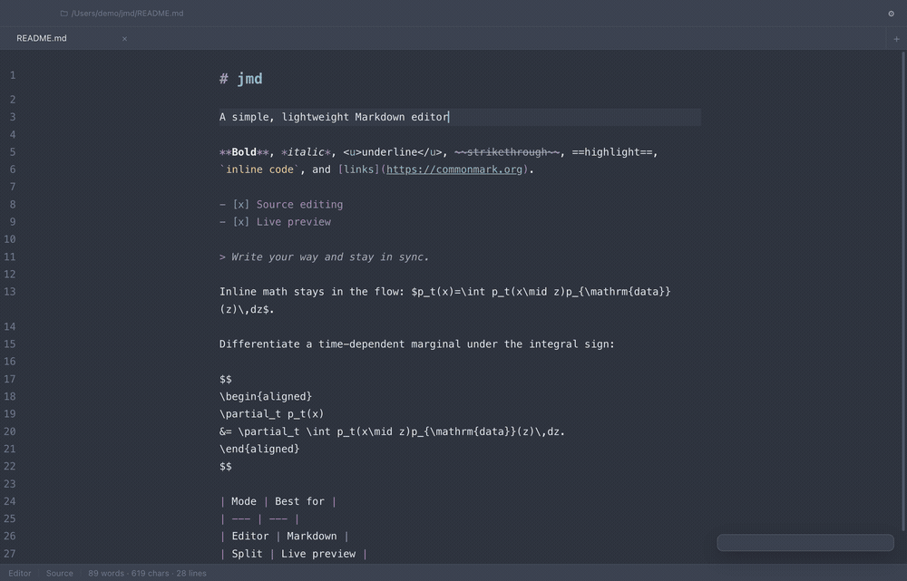

# jmd

軽量な Markdown エディタである。
ソースだけ、ソースとプレビューの分割、プレビューだけの三つの表示を持ち、プレビューはそのまま書き換えられる。
Electron 製で、macOS と Windows で動く。

英語版は [README.en.md](README.en.md) にある。



## できること

- **タブ**：一つのウインドウで複数の文書を開く。
  タブはそれぞれ自分の undo 履歴、選択範囲、スクロール位置を保つ。
  ⌘1…⌘8 が番号のタブ、⌘9 が末尾のタブ、⌃⇥ と ⌃⇧⇥ が隣のタブに移る。
  ドラッグで並べ替えられる。
  ウインドウの外で放すと、その文書だけが新しいウインドウに移り、別の jmd ウインドウの上で放すと、そのウインドウのタブになる。
- **ライブプレビュー**：入力に追随して描き直す。
  実際に変わったブロックだけを差し替えるので、スクロール位置、画像のデコード結果、カーソルの位置がキー入力をまたいで残る。
- **プレビューでの編集**（⌘E / Ctrl+E）：描画された文書の上で直接書くと、Markdown のソースがその下で追随する。
  どこまで書き換えられるかは後述する。
- **プレビューの検索**（⌘F / ⌘⇧F）：描画された文書を検索し、一致した箇所を塗る。
  塗りには CSS Custom Highlight API を使うため、プレビューの DOM には触れない。
  プレビューを編集しながらでも検索でき、入力に応じて一致箇所も追随する。
- **数式**：`$inline$` と `$$display$$` を KaTeX で描く。
  `Costs $5 and $6` は文章のままである。`$` が数式を開くのは、内容に密着しているときに限る。
- **画像**：相対パスは、開いているファイルのフォルダを基準に解決する。
- **記法**：見出しや強調に加えて、表、脚注、定義リスト、タスクリスト、`==ハイライト==`、`~下付き~` と `^上付き^`、シンタックスハイライト付きのコードフェンスを解釈する。
- **6 つのカラーテーマ**：一組の CSS 変数から、エディタ、プレビュー、ウインドウの装飾までを同時に塗る。
  どのテーマにも、好きなアクセント色を上から重ねられる。
- **キー割り当ての変更**：タブの移動、表示の切り替え、プレビューでの編集、プレビューの検索、ファイルの場所を開く操作、設定画面の呼び出しは、設定の Shortcuts から即座に割り当て直せる。
- **ファイルの絶対パス**：ヘッダの、そのタブの真上に置かれる。
  クリックすると Finder（Windows では Explorer）で開く。
  ステータスバーには、現在の表示とプレビュー編集の状態が出る。
- **外部の変更への追従**：開いているファイルが他のプログラムに書き換わったとき、未保存の変更がないタブは読み込み直す。
  未保存の変更があるタブは書き換えずに残し、ステータスバーで知らせる。
- **スクロール同期**：両方向に効く。
  割合ではなくソースの行を基準に合わせるので、長いコードブロックや画像があってもずれない。
- **HTML への書き出し**：現在のテーマを持った単一のファイルとして書き出す。

## 動かす

```sh
npm install
npm start          # ビルドしてから起動する
npm run dev        # vite の開発サーバと electron を並べて起動する
npm run smoke      # 実物のアプリを端から端まで動かす（`npm run dev` が必要）
npm run smoke:dist # 同じ検査を、ビルド済みの dist に対して行う
```

パッケージングは次の三つで行う。

```sh
npm run dist:mac        # release/ に dmg と zip（配布用。公証あり）
npm run dist:mac:local  # 手元で動作を見るだけの mac ビルド（公証なし）
npm run dist:win        # nsis インストーラ
```

### macOS の署名と公証

署名はキーチェーンの Developer ID Application 証明書を electron-builder が自動で見つけて行うため、設定は要らない。
公証は認証情報を環境変数で渡したときだけ走る。渡さなければ警告を出してスキップされる。

認証情報は一度だけキーチェーンに登録しておく。

```sh
# https://appleid.apple.com で「App用パスワード」を発行してから
xcrun notarytool store-credentials jmd-notary \
  --apple-id <Apple ID> --team-id W2Z92AW32J
```

以降は環境変数を一つ渡すだけでよい。

```sh
APPLE_KEYCHAIN_PROFILE=jmd-notary npm run dist:mac
```

electron-builder が公証するのは `.app` だけで、それを包んだ dmg は未署名のまま残る。
実際にダウンロードされるのは dmg のほうなので、`scripts/notarize-dmg.cjs` を
`afterAllArtifactBuild` フックに挿して、dmg にも署名・公証・staple をかけている。
このフックも認証情報が環境にあるときだけ動く。

公証まで通ったかどうかは次の二つで確かめる。どちらも `accepted` と出れば、
ユーザーの手元で警告なしに開ける。

```sh
spctl -a -vvv -t install release/mac-arm64/jmd.app
spctl -a -vvv -t open --context context:primary-signature release/jmd-0.1.0-arm64.dmg
```

## キーボードショートカット

| 操作 | macOS | Windows / Linux | 変更 |
| --- | --- | --- | :---: |
| タブを開く / 閉じる | ⌘T / ⌘W | Ctrl+T / Ctrl+W | 可 |
| 1〜8 番目のタブ / 末尾のタブ | ⌘1…⌘8 / ⌘9 | Ctrl+1…Ctrl+8 / Ctrl+9 | 可 |
| 次 / 前のタブ | ⌘⇥ または ⌃⇥ / ⌘⇧⇥ または ⌃⇧⇥ | Ctrl+Tab / Ctrl+Shift+Tab | 可 |
| ソース / 分割 / プレビュー | ⌘⌃1 / ⌘⌃2 / ⌘⌃3 | Ctrl+Alt+1 / Ctrl+Alt+2 / Ctrl+Alt+3 | 可 |
| プレビューでの編集の切り替え | ⌘E | Ctrl+E | 可 |
| プレビューを検索 | ⌘⇧F | Ctrl+Shift+F | 可 |
| ファイルの場所を開く | ⌘⇧R | Ctrl+Shift+R | 可 |
| 設定 | ⌘, | Ctrl+, | 可 |
| 新しいウインドウ / 開く / 保存 | ⌘N / ⌘O / ⌘S | Ctrl+N / Ctrl+O / Ctrl+S | 不可 |
| 名前を付けて保存 / 検索 | ⌘⇧S / ⌘F | Ctrl+Shift+S / Ctrl+F | 不可 |
| ウインドウを閉じる | ⌘⇧W | プラットフォームの既定 | 不可 |
| undo / redo（どちらの面からでも） | ⌘Z / ⌘⇧Z | Ctrl+Z / Ctrl+Y（Linux では Ctrl+Shift+Z） | 不可 |

⌘F は、いま作業している側を検索する。
プレビューにカーソルがあるか、プレビューだけを表示しているときは描画された文書を、それ以外ではソースを検索する。
どちらを表示していても描画された文書を検索したいときは ⌘⇧F を使う。

割り当てを変えられる操作は、**設定の Shortcuts** に並んでいる。
現在のキーをクリックして新しい組み合わせを押すと、その場で反映され、アプリケーションメニューの表示も同時に変わる。
macOS では ⌘、⌃、⌥ のいずれか、Windows と Linux では Ctrl か Alt が最低一つ必要になる（ファンクションキーだけでもよい）。
通常の入力が奪われないようにするための制限である。
一つの操作に複数のキーを割り当ててもよい。

なお macOS は ⌘⇥ を自前のアプリケーション切り替えに使うため、アプリには届かない。
既定では、実際に jmd まで届く **⌃⇥ と ⌃⇧⇥ も同時に割り当ててある**。
好きなほうに変更してよい。

分割の境目はドラッグで動かせる。
ダブルクリックすると 50/50 に戻る。
プレビューのブロックをダブルクリックすると、ソースのカーソルがその行に飛ぶ。
プレビューだけの表示（⌘⌃3）に切り替えると、プレビューでの編集も一緒に有効になる。
その表示で編集以外にできることがないためである。
⌘⌃1 で戻すと、編集も一緒に切れる。

## タブを引き出す、戻す

タブをウインドウの外へドラッグして放すと、その文書は放した場所へ移る。
何もない場所であれば、そこに新しいウインドウが開く。
別の jmd ウインドウの上であれば、そのウインドウのタブとして加わり、そのウインドウが前に出る。
どちらの場合も、未保存のテキストと保存済みかどうかの状態がそのまま移るため、途中まで書いた文書を引き出しても書きかけのまま続けられる。

移した結果、元のウインドウにタブが残らなくなったときは、そのウインドウが閉じる。
タブが一枚しかないウインドウから何もない場所へ引き出す操作だけは何も起こらない。
ウインドウを閉じて同じものを開き直すだけの操作になるためである。

## プレビューでの編集

正となる文書は、あくまで Markdown のソースである。
プレビューに書き込むと、jmd は入力が途切れるのを待ち、**触れたブロックだけ**を Markdown に戻して、その行をソースに差し込む。
触れていない部分は元の書き方のまま残る。
`*` と `_` のどちらを使っていたか、どこで改行していたか、生の HTML を書いていたかが変わらない。
文書全体を往復させればすべてが正規化されてしまうため、その方法を採っていない。

HTML を往復すると情報が落ちるブロックは、この表示では読み取り専用になり、そのように表示される。
**数式、コードフェンス、生の HTML** の三つである。
クリックすると、ソース側のカーソルがそのブロックに移る。

それ以外の段落、見出し、リスト、表、リンク、強調は、その場で書き換えられる。
Enter を押せば、新しいブロックがそこに生まれる。

## ファイルが外で書き換わったとき

jmd は、開いているファイルをメインプロセスで監視している。
他のエディタや `git checkout` がファイルを書き換えると、そのファイルを開いているタブのうち、未保存の変更がないものは新しい内容を読み込み直す。
読んでいた位置は保たれる。

未保存の変更があるタブは書き換えない。
ステータスバーが「changed on disk」と知らせるだけで、どちらを残すかの判断は書き手に委ねられる。
保存すればその内容がファイルの内容になり、通知も止まる。

自分の保存はこの仕組みの対象外である。
書き込んだ内容を覚えているので、それが監視から戻ってきても外部の変更とは見なさない。

## 構成

```
electron/          メインプロセス。ウインドウ、メニュー、ファイルダイアログ、
                   ファイル監視、jmd-file:// スキーム
src/
  main.js          全体の配線。タブ、表示、テーマ、スクロール同期、ファイル入出力
  tabs.js          タブの帯。選択、閉じる操作、並べ替え、ウインドウ外への切り離し
  shortcuts.js     操作の識別子、キーの割り当て、キーイベントとの対応づけ
  settings-panel.js  設定ダイアログ。テーマ、アクセント色、ショートカット
  about-panel.js   About ダイアログ。バージョン、開発者、リポジトリ、スポンサー
  editor/          CodeMirror 6 のソース面
  markdown/        markdown-it のパイプラインと KaTeX プラグイン
  preview/         描画、DOM のパッチ、プレビューでの編集、プレビューの検索
  styles/          ウインドウの装飾、プレビューの組版、カラーテーマ
test/smoke.cjs     実物の Electron ウインドウに対する通しの検査
```

描画された HTML は DOMPurify を通してから DOM に入る。
ローカルのファイルは、CSP を緩めるのではなく専用の `jmd-file://` スキームで配信している。
レンダラは context isolation 付きのサンドボックスで動く。

キーの割り当てを持っているのはメニューではなくレンダラである。
アプリケーションメニューは現在のキーを表示するだけで、macOS では登録もしない。
割り当てを変えたときに、何も作り直さずその場で効くのはこのためである。

## テーマを追加する

`src/styles/themes.css` に CSS 変数の塊を一つ足し、`src/themes.js` のリストに一行加える。
どのテーマも同じ変数の語彙を埋めるので、既存のものを写して色だけ変えればよい。
他に手を入れる場所はない。
設定ダイアログの見本は、そのテーマ自身の変数から組み立てられる。

選択範囲には二つの変数を使う。
`--selection` が文字の背後に敷く帯、`--selection-fg` が選択された文字の色である。
プレビューにはリンクやコード、強調のように色のついた文字が並ぶため、帯だけを決めても読みやすさは決まらない。
文字の色も一緒に指定する。

## ショートカットを追加する

`src/shortcuts.js` の `ACTION_GROUPS` に、既定のキーとともに項目を足す。
続けて `src/main.js` の `ACTIONS` に、同じ識別子で処理を書く。
これで設定ダイアログに現れる。
メニューにも出したい場合は、`electron/main.js` で `actionItem()` を一つ加える。
